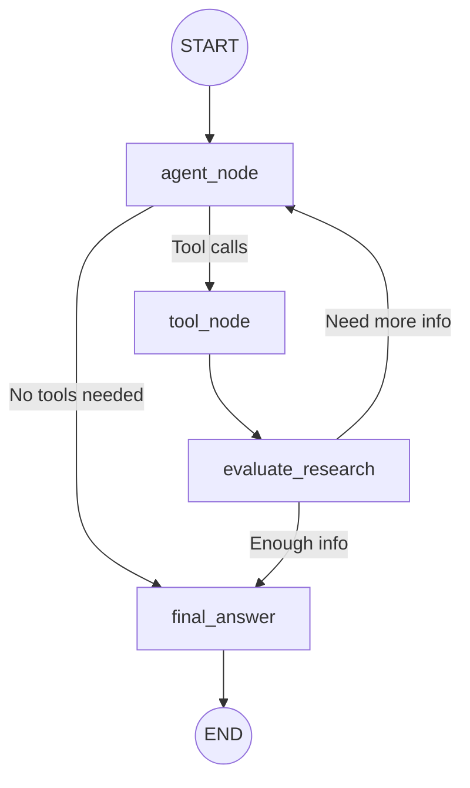

# 🔬 Mini Research Agent

A small educational AI agent built with **LangChain** and **LangGraph** to demonstrate the fundamentals of agentic AI — tool calling, state management, conditional routing, and iterative research loops.

This project was built as a learning exercise during an internship to understand how AI agents work internally, rather than as a production-grade system.

---

## What It Does

The Mini Research Agent receives a user's question and dynamically decides how to answer it:

1. **Direct answer** — if general knowledge is sufficient.
2. **Web search** — if current or external information is needed.
3. **Calculation** — if arithmetic is required.
4. **Multi-step research** — combining multiple tools and iterating when the first search isn't enough.

```
User: What is India's current population and what is 2% of it?

🔎 Agent → Web Search
   Query: "current population of India"
   ✓ Search completed

🧮 Agent → Calculator
   Expression: 1450000000 * 0.02
   ✓ Result: 29000000

🧠 Research Evaluation (step 1/3)
   Enough information: YES
   Reason: We have the population figure and the calculation result.

📋 FINAL ANSWER
India's current population is approximately 1.45 billion.
2% of that is approximately 29 million (29,000,000).

Sources:
1. World Population Review — https://...
```

---

## Architecture



### Nodes

| Node | What It Does |
|---|---|
| `agent_node` | Calls the LLM with tools. The LLM decides whether to use a tool or answer directly. |
| `tool_node` | Executes the tool calls requested by the agent (web search, calculator). |
| `evaluate_research` | Uses structured LLM output to decide if enough info has been gathered. |
| `final_answer` | Generates the polished final answer with sources. |

### Routing

| Edge | Condition |
|---|---|
| `agent_node` → `tool_node` | LLM requested tool calls |
| `agent_node` → `final_answer` | LLM answered directly (no tools) |
| `evaluate_research` → `agent_node` | Information insufficient AND under max steps |
| `evaluate_research` → `final_answer` | Information sufficient OR max steps reached |

---

## Technologies

| Technology | Purpose |
|---|---|
| **Python** | Programming language |
| **LangChain** | Framework for working with LLMs, tools, and messages |
| **LangGraph** | Framework for building stateful agent workflows as graphs |
| **Groq (LLaMA 3.1)** | Free LLM API that powers the agent's reasoning and tool decisions |
| **Tavily** | AI-optimized web search API |

---

## Tools

### 🔎 Web Search (`search_web`)

Searches the internet using Tavily for current information — news, statistics, facts.

```python
search_web("current population of India")
```

### 🧮 Calculator (`calculator`)

Safe arithmetic evaluator using Python's `ast` module. Supports `+`, `-`, `*`, `/`, `%`, `**`, and parentheses. Rejects arbitrary code execution.

```python
calculator("(85000 - 70000) / 70000 * 100")
```

---

## Key LangGraph Concepts

### State

A `TypedDict` that holds all the data flowing through the graph:

```python
class AgentState(TypedDict):
    messages: Annotated[list, add_messages]  # Conversation history
    research_count: int                       # Research iterations done
    research_decision: str                    # "sufficient" or "insufficient"
```

The `add_messages` reducer means new messages are **appended** to the list instead of overwriting it.

### Nodes

Functions that do work. Each node receives the current state and returns updates to it.

### Edges

Connections between nodes. A normal edge always goes to the same next node.

### Conditional Edges

Edges where the next node depends on the current state. For example, after the agent node, we check: did it request tools? If yes → `tool_node`. If no → `final_answer`.

### Loops

The graph can loop: `agent_node` → `tool_node` → `evaluate_research` → back to `agent_node`. This is how the agent performs iterative research.

### Bounded Research

A `MAX_RESEARCH_STEPS = 3` safeguard prevents infinite loops. If the agent hasn't found enough info after 3 iterations, it generates the best answer it can.

---

## Setup

### Using `uv` (Recommended - Ultra Fast)

1. **Install dependencies and create virtual environment**:
   ```bash
   uv sync
   ```

2. **Run the Streamlit Web Interface** 🌐:
   ```bash
   uv run streamlit run app.py
   ```

3. **Run the Terminal CLI Interface** 💻:
   ```bash
   uv run main.py
   ```

---

### Using standard `pip`

1. **Create virtual environment**:
   ```bash
   python -m venv .venv
   ```
   Activate (Windows): `.venv\Scripts\activate`  
   Activate (macOS/Linux): `source .venv/bin/activate`

2. **Install dependencies**:
   ```bash
   pip install -r requirements.txt
   ```

3. **Run the agent**:
   ```bash
   python main.py
   ```

---

### Configure API keys

Edit the `.env` file with your actual keys:

```
GROQ_API_KEY=gsk_...
TAVILY_API_KEY=tvly-...
```

- **Groq key**: [console.groq.com/keys](https://console.groq.com/keys) (free — no credit card required)
- **Tavily key**: [app.tavily.com](https://app.tavily.com) (free tier: 1,000 searches/month)

> **Note**: The project also supports OpenAI (`OPENAI_API_KEY`) and xAI (`XAI_API_KEY`) — just set the appropriate key in `.env` and the agent will auto-detect the provider.

---

## Example Questions

| # | Question | Expected Tools |
|---|---|---|
| 1 | What is 17.5% of 85,000? | Calculator |
| 2 | Who is the current CEO of NVIDIA? | Web Search |
| 3 | What is India's current population and what is 2% of it? | Web Search → Calculator |
| 4 | Compare the latest NVIDIA and AMD AI GPUs based on price and specs. | Multiple Web Searches |
| 5 | Explain what a transformer is in simple terms. | None (direct answer) |

---

## Project Structure

```
mini-research-agent/
├── .env                 # API keys (not committed)
├── .gitignore           # Git ignore rules
├── requirements.txt     # Python dependencies
├── README.md            # This file
├── tools.py             # Web Search + Calculator tools
├── agent.py             # LLM config, system prompt, tool binding
├── graph.py             # LangGraph state, nodes, edges, research loop
└── main.py              # Terminal UI and entry point
```

---

## Limitations

- **Educational project** — not production-grade.
- **Search quality** depends on Tavily's results and the free-tier limits.
- **LLM decisions are probabilistic** — the agent may sometimes choose different tools for the same question.
- **Research depth** is limited to 3 steps by design.
- **No memory** — each question starts fresh with no context from previous questions.
- **No authentication** — API keys are stored locally in `.env`.

---

## Future Improvements

These are NOT implemented — they are ideas for extending the project:

- Better source ranking and filtering
- PDF/document research (RAG)
- Persistent conversation memory
- Web page content extraction
- Human-in-the-loop approval before tool calls
- Web frontend (React/Streamlit)
- LangSmith tracing for observability
- More sophisticated research planning
- Additional tools (e.g., Wikipedia, code execution)

---

## Prebuilt Agent Comparison

This project builds a **custom StateGraph** to make every concept visible. LangGraph also provides a prebuilt alternative:

```python
from langgraph.prebuilt import create_react_agent

# This single line replaces our entire graph.py:
agent = create_react_agent(llm, tools)
result = agent.invoke({"messages": [("user", "What is 2+2?")]})
```

`create_react_agent` automatically handles the agent → tool → agent loop internally. It's simpler to use but hides the state, nodes, edges, and routing logic that this project was built to demonstrate.

**Use the prebuilt agent** when you want production simplicity.
**Use a custom StateGraph** when you need custom logic (like our research evaluation loop) or want to understand how agents work internally.
